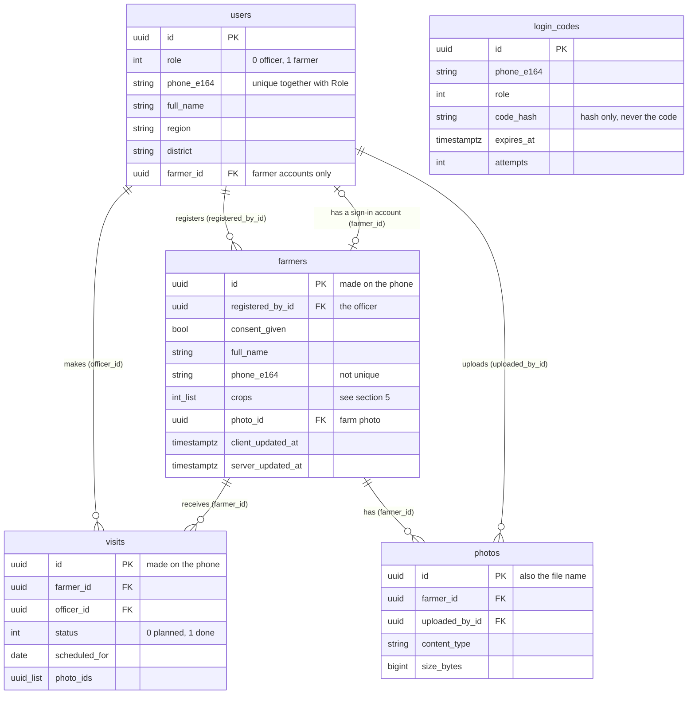

# Data dictionary: every table and column

What the server database (PostgreSQL) stores, what each column means, which values it can hold, and why it is built that way. The tables are defined in C# in [`backend/Services/Libs/Data/Entities/`](../backend/Services/Libs/Data/Entities/) and created by the migration in [`Data/Migrations/`](../backend/Services/Libs/Data/Migrations/). Decision background: [ADR 0006](adr/0006-postgres-over-nosql.md) (PostgreSQL), [ADR 0005](adr/0005-offline-first-sync.md) (offline sync), [ADR 0007](adr/0007-phone-number-auth.md) and [ADR 0022](adr/0022-sign-in-codes-and-tokens.md) (sign-in), [ADR 0023](adr/0023-database-naming-and-links.md) (names and enforced links).

_Last updated: 5 October 2026 (migration `InitialSchema`). Names are lower-case snake_case (`full_name`, `phone_e164`), the PostgreSQL convention, so SQL needs no quotes: `select full_name from users;`. The C# code keeps its own names (`FullName`); the mapping is automatic._

---

## 1. How to read this

| You see | It means |
|---|---|
| `uuid` | A 128-bit unique ID such as `0192f0a0-0000-7000-8000-000000000001`. For farmers, visits and photos the **phone makes the ID** when it saves offline, so sending the same record twice can never create a copy. We use time-ordered IDs (UUID version 7), which keep the database index fast. |
| `timestamptz` | A moment in time, stored in UTC (world time). The app shows it in Ghana time, which is the same as UTC. |
| `varchar(n)` | Text of at most *n* characters. |
| `integer` with a **code list** | A fixed choice (crop, soil...). The database stores a number; the API and app use a word (`"maize"`). Section 5 lists every value. Numbers are never changed or reused: new choices are added at the end. |
| `integer[]` | A list of choices, e.g. crops `{0,3}` = maize and groundnut. A farmer can pick several. |
| Required: **yes** | The column can never be empty (`NOT NULL`). **no** means it is optional or not known yet (`NULL`). |
| 🔒 | Personal data under the Ghana Data Protection Act 2012. Never written to logs; shown only to the officer who registered the farmer and to the farmer. |

---

## 2. Who is who: people, organisations and how they connect

AgroConnect sits between the Ministry, its extension officers and the farmers they serve. This section shows **who** is involved, **how they relate**, and **what each one can do in the system**. The tables in sections 3 and 4 store exactly these relationships.

### 2.1 The picture

```mermaid
flowchart TB
    MOFA["MoFA<br/>Ministry of Food and Agriculture"]
    REG["16 regions"]
    DIS["Districts"]
    OFF["Extension officers<br/>(about 250)"]
    FAR["Farmers<br/>(15,000+)"]
    FAM["Family members<br/>sharing one phone"]
    VIS["Visits"]
    PART["Partner farmer groups<br/>Ashaiman Urban Farmers Association,<br/>Northern Ghana Farmers Network"]
    NET["Mobile networks<br/>MTN, Vodafone, AirtelTigo"]
    AT["Africa&#39;s Talking<br/>SMS and USSD gateway"]
    DEAL["Agro-dealers (500+)<br/>Weeks 2 and 3"]
    SYS(("AgroConnect"))

    MOFA -->|"organised into"| REG
    REG -->|"divided into"| DIS
    MOFA -->|"employs, assigns to a district"| OFF
    OFF -->|"works in"| DIS
    OFF -->|"registers (with consent)"| FAR
    OFF -->|"plans and makes"| VIS
    VIS -->|"for one"| FAR
    FAR ---|"may share a phone with"| FAM
    PART -->|"bring farmers, test the app"| FAR
    FAR -->|"simple phones: USSD and SMS"| NET
    NET --- AT
    AT -->|"calls our API"| SYS
    OFF -->|"app on a smartphone"| SYS
    FAR -->|"app, if they have a smartphone"| SYS
    MOFA -.->|"reads summaries (later)"| SYS
    DEAL -.->|"sell inputs to (later)"| FAR
```



The same in words:
- **MoFA** (the Ministry of Food and Agriculture) runs extension services across **16 regions**, each split into **districts**.
- **Extension officers** (about 250) work for MoFA in a district. Each officer **registers farmers** (with the farmer's recorded consent) and **visits** them to advise.
- **Farmers** (15,000+) are registered by an officer. A farmer with a phone can sign in to see their own profile. A farmer with no smartphone uses **USSD and SMS**. Family members often **share one phone**.
- **Partner farmer groups** (Ashaiman Urban Farmers Association, Northern Ghana Farmers Network) bring farmers to test the app in their own languages.
- **Mobile networks** carry the SMS and USSD traffic, and **Africa's Talking** connects them to our API.
- **Agro-dealers** (500+) sell seeds and fertiliser to farmers. They join in Weeks 2 and 3.
- **MoFA administrators** will read summaries and reports (a "Could" in Week 1, the full dashboard in Week 4).

Dashed lines are planned, not yet built.

### 2.2 Roles in the system: who can do what

| Role | Signs in with | Can do | Cannot do | Stored as |
|---|---|---|---|---|
| **Extension officer** (account added by a MoFA admin; phone and computer) | Phone + SMS code | Register farmers, edit the farmers they registered, plan and record visits, sync | See or change other officers' farmers | `users` row with `role = 0` |
| **Farmer** (registered by an officer; phone or computer, ADR 0024 amendment of 2026-10-07) | Phone + SMS code (the phone the officer registered) | See their own profile and visits, change their language | See other farmers, register anyone | `users` row with `role = 1`, and `farmer_id` = their `farmers` row (created at first sign-in) |
| **Farmer with a simple phone** | Nothing to install: USSD menu and SMS | Register or confirm details by USSD, receive SMS | Use the app | A `farmers` row; contact preferences in `reach_channels` |
| **Farmer with no phone** | Not applicable | Is registered and visited by the officer | Be contacted directly | A `farmers` row with `has_no_phone = true` |
| **MoFA administrator** (planned; first one created by a script, then added by other admins; computer only; chooses *MoFA admin* on the desktop *Who are you?*) | Phone + SMS code | Read-only summaries for their region or district; add and remove extension officers and admins; turn off a lost phone | Change farmer records | A new `admin` role |
| **Agro-dealer** (planned, Weeks 2 and 3) | To be decided | Share prices and stock | See farmers' personal data | New tables in Week 2 |

There is no separate "district office" role: a MoFA admin's access covers one region or district. Who creates each account and which device each role uses: ADR 0024.

### 2.3 The relationships, one by one

| Relationship | How many | Where it is stored |
|---|---|---|
| An officer works in one region and district | many officers : 1 district | `users.region`, `users.district` |
| An officer registers farmers | 1 officer : many farmers | `farmers.registered_by_id` → `users.id` |
| A farmer is registered by one officer | each farmer has exactly 1 | the same column |
| A farmer may have a sign-in account | 1 farmer : 0 or 1 account | `users.farmer_id` → `farmers.id` |
| Several farmers can share one phone | 1 phone : many farmers | `farmers.phone_e164` (not unique). The first farmer registered on that phone gets the farmer sign-in |
| An officer makes visits | 1 officer : many visits | `visits.officer_id` → `users.id` |
| A farmer receives visits | 1 farmer : many visits | `visits.farmer_id` → `farmers.id` |
| A farmer has a farm photo | 1 farmer : 0 or 1 photo | `farmers.photo_id` → `photos.id` |
| A visit has photos | 1 visit : many photos | `visits.photo_ids` (a list) |
| A photo shows one farmer's farm and was taken by one person | many photos : 1 farmer | `photos.farmer_id`, `photos.uploaded_by_id` |
| A phone number asks for sign-in codes | 1 phone : many codes | `login_codes.phone_e164` + `role` |

### 2.4 The tables as a diagram



Only the main columns are shown; section 4 lists them all. `login_codes` has no link line: it is matched to `users` by phone number and role, because a code can be asked for before any account exists.

### 2.5 Planned as the system grows

| Planned | Why | When |
|---|---|---|
| `regions` and `districts` tables | Pick from a list instead of typing; MoFA reports by district | With the MoFA summary |
| `admin` role | MoFA read-only summaries | With the MoFA summary |
| Officers in one district can see each other's farmers | Cover for a colleague who is away | After Week 1, once MoFA agrees the data access rules |
| Farmer groups and cooperatives | Partners such as the Ashaiman association register members together | Week 2 |
| `consents` table | A history of consent (given, withdrawn), not only the latest | Before real farmer data |
| `ussd_sessions` table | Remember where a simple-phone user is in the USSD menu | With USSD |
| `conflict_log` table | Record when a newer edit replaced another, so it can be explained | When officers use several devices a lot (sync keeps the newest change today, ADR 0032) |
| Agro-dealers, prices, payments | Weeks 2 and 3 scope | Weeks 2 and 3 |

---

## 3. The tables and how they connect

```
users ───────────────┐ registers                 ┌──────────── visits
 (officers, farmers) │                           │  (officer visits to a farmer)
   │                 ▼                           │
   │ farmer account  farmers ◀───────────────────┘
   └──────────────▶  (one row per registered farmer)
                       ▲
                       │ belongs to
                     photos (farm and visit photos; the image is in storage)

login_codes: SMS sign-in codes, matched to users by phone number and role
```

| Link | Meaning | Checked by the database? |
|---|---|---|
| `farmers.registered_by_id` → `users.id` | The officer who registered the farmer | Yes: `fk_farmers_users_registered_by_id` |
| `users.farmer_id` → `farmers.id` | For a farmer account: the farmer record it belongs to | Yes: `fk_users_farmers_farmer_id` |
| `visits.farmer_id` → `farmers.id` | Which farmer was visited | Yes: `fk_visits_farmers_farmer_id` |
| `visits.officer_id` → `users.id` | Which officer made the visit | Yes: `fk_visits_users_officer_id` |
| `photos.farmer_id` → `farmers.id` | Whose farm the photo shows | Yes: `fk_photos_farmers_farmer_id` |
| `photos.uploaded_by_id` → `users.id` | Who took and uploaded it | Yes: `fk_photos_users_uploaded_by_id` |
| `farmers.photo_id` → `photos.id` | The farm photo from registration step 4 | No, on purpose: offline, the farmer record syncs **before** its photo is uploaded, so the photo row does not exist yet. The API checks it instead, from the photo upload on. |
| `visits.photo_ids` → `photos.id` | Photos taken during the visit | No: a list cannot have a foreign key, and photos upload after the visit syncs. The API checks it instead, from the photo upload on. |

**Foreign key** = a rule in the database itself that a link must point at a row that exists. Saving a visit for a farmer that does not exist fails with `fk_visits_farmers_farmer_id`, whatever program tries it. Deleting an officer or farmer that other rows point at is refused too (`RESTRICT`), so no history is lost by accident. A test proves it (`tests/Api.Tests/DatabaseSchemaTests.cs`).

---

## 4. The tables

### 4.1 `users`: people who can sign in

**What a row is:** one person who can sign in, as an officer or as a farmer.
- **Officers** are added by MoFA (for now they are seeded from settings).
- **A farmer account** is created automatically the first time a registered farmer signs in.

| Column | Type | Required | Meaning | Example |
|---|---|---|---|---|
| `id` | uuid | yes | The account's unique ID; it goes into the sign-in token | `01a10ac0-450d-7b2c-...` |
| `role` | integer (code list `UserRole`) | yes | `0` officer, `1` farmer. Decides what the person may see and do | `0` |
| `phone_e164` 🔒 | varchar(16) | yes | Phone number in international form (`+233` + 9 digits), however it was typed ("024 000 0001") | `+233240000001` |
| `full_name` 🔒 | varchar(100) | yes | Name shown on Home and Profile. For a farmer, copied from their farmer record | `Fuseini Alhassan` |
| `region` | varchar(100) | no | The officer's region. For a farmer, their region and district | `Northern` |
| `district` | varchar(100) | no | The officer's district | `Savelugu` |
| `farmer_id` | uuid | no | **Only for farmer accounts:** their row in `farmers`. Empty (`NULL`) for officers, who have no farmer record | `NULL` (officer) |
| `created_at` | timestamptz | yes | When the account was created | `2026-10-05 06:28:56+00` |

**Rules and indexes:**
- **Unique (`phone_e164`, `role`).** One officer account and one farmer account per phone at most. The same number can be both, e.g. an officer who also farms.

### 4.2 `login_codes`: SMS sign-in codes

**What a row is:** one 6-digit code texted to a phone on "Send code". The code itself is **never stored**, only a keyed hash, so a leaked table reveals no codes.

| Column | Type | Required | Meaning | Example |
|---|---|---|---|---|
| `id` | uuid | yes | The code request's ID | |
| `phone_e164` 🔒 | varchar(16) | yes | The phone the code was sent to | `+233240000001` |
| `role` | integer (`UserRole`) | yes | Whether it was asked for on the officer or the farmer sign-in screen | `0` |
| `code_hash` | varchar(64) | yes | HMAC-SHA256 of phone + code with the server's secret key, as 64 hex characters. Cannot be turned back into the code | `9F2C41...` |
| `created_at` | timestamptz | yes | When it was sent. Used for "Resend in 0:45" (one per 45 seconds) and "at most 5 an hour" | |
| `expires_at` | timestamptz | yes | 10 minutes after `created_at`; after that the code no longer works | |
| `attempts` | integer | yes | Wrong codes typed so far. At 5 the code is locked and a new one is needed | `0` |
| `used_at` | timestamptz | no | When it was used to sign in. A used code never works again | `NULL` until used |

**Rules and indexes:**
- **Index (`phone_e164`, `role`, `created_at`).** Finds the latest code for a phone quickly, for checking and for the resend limits.
- **A row is stored even when the number has no account.** "Send code" then behaves the same for every number, so nobody can use it to find out who is registered. No SMS is sent for such a row.

### 4.3 `farmers`: registered farmers (the 7 registration steps)

**What a row is:** one farmer registered by an officer. The ID is made on the officer's phone, so the record can be saved offline and synced later without ever creating a copy.

**Step 1: consent**

| Column | Type | Required | Meaning | Example |
|---|---|---|---|---|
| `id` | uuid | yes | The farmer's ID, made on the phone | `0192f0a0-0000-7000-8000-000000000001` |
| `registered_by_id` | uuid | yes | The officer (`users.id`) who registered the farmer. Set by the server from the officer's sign-in when the record is synced, never from the phone (ADR 0032) | |
| `consent_given` | boolean | yes | The farmer agreed (recorded consent) to their data being kept. Registration cannot continue without it | `true` |
| `consent_at` | timestamptz | yes | When consent was given | |
| `language` | integer (`Language`) | yes | The language consent was given in, which is also the farmer's preferred language | `1` (Twi) |

**Step 2: about the farmer**

| Column | Type | Required | Meaning | Example |
|---|---|---|---|---|
| `full_name` 🔒 | varchar(100) | yes | The farmer's name | `Ama Boateng` |
| `phone_e164` 🔒 | varchar(16) | no | The farmer's phone, if they have one. **Not unique:** family members often share one phone | `+233240001234` |
| `has_no_phone` | boolean | yes | Ticked "No phone"; then `phone_e164` is empty and the farmer is reached through the officer | `false` |
| `gender` 🔒 | integer (`Gender`) | no | Optional; includes "prefer not to say" | `0` (female) |
| `age_band` 🔒 | integer (`AgeBand`) | no | An age band, not a birth date: we collect only what we need | `2` (36-50) |
| `community` | varchar(100) | no | Village or community | `Tolon` |
| `region_district` | varchar(100) | no | Region and district as chosen on screen | `Northern · Tolon District` |

**Step 3: the farm**

| Column | Type | Required | Meaning | Example |
|---|---|---|---|---|
| `crops` | integer[] (`Crop`) | yes (may be empty) | Crops grown; several allowed | `{0,3}` (maize, groundnut) |
| `farm_size` | numeric(9,2) | no | Farm size, two decimals, in `farm_size_unit` | `2.50` |
| `farm_size_unit` | integer (`AreaUnit`) | yes | `0` acres, `1` hectares | `0` |
| `soil` | integer (`SoilType`) | no | Soil type, or "not sure" | `2` (loamy) |
| `planting_seasons` | integer[] (`PlantingSeason`) | yes (may be empty) | When the farmer plants | `{0}` (rainy) |

**Step 4: location and photo**

| Column | Type | Required | Meaning | Example |
|---|---|---|---|---|
| `latitude` 🔒 | double | no | GPS latitude of the farm. Empty if GPS was unavailable: GPS never blocks a registration | `9.4316` |
| `longitude` 🔒 | double | no | GPS longitude | `-1.0119` |
| `location_accuracy_metres` | double | no | How accurate the GPS fix was, shown to the officer ("within 12 m") | `12` |
| `photo_id` | uuid | no | The farm photo (`photos.id`) | |

**Step 5: contact**

| Column | Type | Required | Meaning | Example |
|---|---|---|---|---|
| `phone_type` | integer (`PhoneType`) | no | Smartphone, basic phone or no phone. Decides app or USSD/SMS | `1` (basic phone) |
| `data_purchase` | integer (`DataPurchase`) | no | How often the farmer buys mobile data | `3` (none) |
| `reach_channels` | integer[] (`ContactChannel`) | yes (may be empty) | How the farmer wants to be reached | `{0}` (SMS) |

**Step 6: money (optional step)**

| Column | Type | Required | Meaning | Example |
|---|---|---|---|---|
| `income_sources` | integer[] (`IncomeSource`) | yes (may be empty) | Where income comes from; **kinds, never amounts** | `{0,2}` (crops, trading) |
| `has_bank_account` 🔒 | boolean | no | Has a bank account; empty if skipped | `false` |
| `mobile_money` 🔒 | integer (`MobileMoneyUse`) | no | Uses mobile money: yes, no or skipped | `0` (yes) |

**Step 7: help needed**

| Column | Type | Required | Meaning | Example |
|---|---|---|---|---|
| `last_agent_visit` | integer (`LastAgentVisit`) | no | When an extension officer last visited | `2` (last year) |
| `help_needed` | integer[] (`HelpNeed`) | yes (may be empty) | What help the farmer wants | `{0,3}` (seeds, market prices) |

**Sync bookkeeping**

| Column | Type | Required | Meaning |
|---|---|---|---|
| `client_updated_at` | timestamptz | yes | When the record last changed **on the phone**. If two phones change the same farmer, the newer change wins. A phone clock set in the future is corrected to the server's time. |
| `server_updated_at` | timestamptz | yes | When the **server** last stored a change. Phones ask for "changes since my last sync" using this time. |
| `created_at` | timestamptz | yes | When the server first received the farmer |

**Rules and indexes:**
- **Index on `phone_e164`, not unique.** Families share phones, so instead of blocking, the app warns "a farmer with this phone already exists" (the duplicate check).
- **Index (`registered_by_id`, `server_updated_at`).** Quickly finds "my farmers that changed since my last sync" for each officer.

### 4.4 `visits`: extension visits to farmers

**What a row is:** one visit by an officer to a farmer. It is created when **planned** and updated when **done**, with what was discussed and seen. The ID is made on the phone.

| Column | Type | Required | Meaning | Example |
|---|---|---|---|---|
| `id` | uuid | yes | The visit's ID, made on the phone | |
| `farmer_id` | uuid | yes | The farmer visited (`farmers.id`) | |
| `officer_id` | uuid | yes | The officer (`users.id`) | |
| `status` | integer (`VisitStatus`) | yes | `0` planned, `1` done | `1` |
| `scheduled_for` | date | yes | The day the visit is planned for (shown in "Today's visits") | `2026-10-06` |
| `completed_at` | timestamptz | no | When it was marked done; empty while planned | |
| `topics` | integer[] (`VisitTopic`) | yes (may be empty) | What was discussed | `{1,2}` (fertiliser, pests) |
| `observations` | integer[] (`FarmObservation`) | yes (may be empty) | What the officer saw on the farm | `{1}` (pests) |
| `notes` 🔒 | varchar(2000) | no | Free notes; may mention the farmer | `Advised neem spray` |
| `photo_ids` | uuid[] | yes (may be empty) | Photos taken during the visit (`photos.id`) | `{}` |
| `client_updated_at`, `server_updated_at`, `created_at` | timestamptz | yes | Same sync bookkeeping as `farmers` | |

**Rules and indexes:**
- **Index on `farmer_id`:** a farmer's visit history on the detail screen.
- **Index (`officer_id`, `server_updated_at`):** an officer's visits changed since their last sync.

### 4.5 `photos`: farm and visit photos

**What a row is:** facts about one photo. The image itself is in private photo storage (S3 on the servers), named by the photo's ID, so file names hold no personal data. Photos are shrunk on the phone to about 150 KB before upload.

| Column | Type | Required | Meaning | Example |
|---|---|---|---|---|
| `id` 🔒 | uuid | yes | The photo's ID, made on the phone; also its file name in storage. The image shows a farm and may show people | |
| `farmer_id` | uuid | yes | Whose farm (`farmers.id`) | |
| `uploaded_by_id` | uuid | yes | Who uploaded it (`users.id`) | |
| `content_type` | varchar(50) | yes | Image format; only JPEG, WebP or PNG are accepted | `image/webp` |
| `size_bytes` | bigint | yes | File size; uploads over 2 MB are refused | `148213` |
| `created_at` | timestamptz | yes | When it was uploaded | |

**Rules and indexes:**
- **Index on `farmer_id`:** all photos of one farmer.

### 4.6 `__EFMigrationsHistory`: which database changes are applied

Written by the migration tool, never by hand. One row per applied migration (`MigrationId` such as `20261005010519_InitialSchema`, and `ProductVersion`, the EF Core version). On start-up the API compares it with the migrations in the code and applies any that are missing.

### 4.7 Tables on the phone (IndexedDB, database `agroconnect`)

The app keeps its own small database in the browser, so an officer can register farmers with no network (ADR 0005, ADR 0027). It is defined in `frontend/src/db/local.ts` with Dexie. Names here are camelCase, because they are JavaScript objects, not SQL columns. Choices are stored as the **words** (`"maize"`), exactly as the API sends them.

| Table | Key | Indexed by | What it holds |
|---|---|---|---|
| `farmers` | `id` (UUID made on the phone) | `phoneE164`, `syncStatus`, `clientUpdatedAt` | Farmers registered on this phone. The same fields as the server's `farmers` table (4.3), plus `syncStatus`. |
| `photos` | `id` (UUID) | `farmerId` | The shrunk farm photo (about 150 KB) waiting to be uploaded. `farmerId` is empty while the form is still a draft. |
| `outbox` | `seq` (counts up: 1, 2, 3) | `kind`, `recordId` | The "to send" queue: one row per farmer or visit waiting for sync (`kind` is `farmer` or `visit`). Sent to `POST /api/sync` in batches of 100, oldest first (ADR 0029, 0032). A row the server does not answer (a visit whose farmer is not on the server yet) stays for the next sync. |
| `drafts` | `id` (always `registration`) | | The half-filled registration form, kept after consent so nothing is lost if the app closes. |
| `visits` | `id` (UUID made on the phone) | `farmerId`, `scheduledFor`, `syncStatus` | Visits logged on this phone (added in version 2 of the phone database). The same fields as the server's `visits` table (4.4), plus `nextVisit` and `syncStatus`. |

**`farmers` on the phone, the columns that differ from the server:**

| Column | Example | Meaning |
|---|---|---|
| `phoneE164` | `+233240001234` | The phone in international form; empty when the farmer has no phone. Indexed for the duplicate check. |
| `language` | `tw` | The app language when consent was given. |
| `consentAt` | `2026-10-07T10:15:00Z` | When the farmer said "Yes, I agree". |
| `registeredById` | user ID | The officer who registered the farmer. |
| `clientUpdatedAt` | ISO time | When it last changed on this phone; the newest change wins on sync. |
| `syncStatus` | `waiting` | `waiting` (not sent yet) · `synced` (on the server) · `failed` (the server refused it; shown as "To fix"). |
| `syncProblem` | `Phone number is too short` | Why the server refused it, in the officer's language. Cleared when the farmer is edited. |
| `photoId`, `photoSizeBytes` | UUID, `148213` | The photo in the `photos` table, and its size after shrinking. |

**`outbox` columns:** `kind` (`farmer` today; `visit` later), `recordId` (the farmer's ID), `createdAt`, `attempts` (how many times sending failed; used for the 1, 2, 4, 8 second waits).

**`drafts` columns:** `data` (every answer so far), `step` (1 to 7, where to reopen), `updatedAt`.

| `cache` | `key` ("<user id>:<what>") | | The last answer of each farmer-app call (my farm, prices, weather...), so the farmer's screens open offline. Added in version 3. |

**`visits` columns:** `farmerId`, `officerId`, `status` (`done` for visits logged on the phone; `planned` comes from the server later), `scheduledFor` (the day, `2026-10-07`), `completedAt`, `topics` (VisitTopic words), `observations` (FarmObservation words), `notes`, `photoIds`, `nextVisit` (`one_week`, `two_weeks`, `one_month`, `none`: phone only, to plan the next visit), `createdAt`, `clientUpdatedAt`, `syncStatus`.

**How a registration is saved:** one transaction adds the farmer, adds its `outbox` row, links the photo (`farmerId`) and deletes the draft. Either all four happen or none, so a farmer is never saved without being queued for sync.

---

## 5. Code lists (what the numbers mean)

The database stores the **number**; the API and the app use the **word**. Screens show the translated label.

| Code list | Values (number = word: meaning) |
|---|---|
| `UserRole` | 0 = `officer`: extension officer · 1 = `farmer` |
| `Language` | 0 = `en`: English · 1 = `tw`: Twi · 2 = `ee`: Ewe · 3 = `dag`: Dagbani |
| `Gender` | 0 = `female` · 1 = `male` · 2 = `other` · 3 = `prefer_not_to_say` |
| `AgeBand` | 0 = `18-25` · 1 = `26-35` · 2 = `36-50` · 3 = `over_50` |
| `Crop` | 0 = `maize` · 1 = `sorghum` · 2 = `rice` · 3 = `groundnut` · 4 = `yam` · 5 = `cassava` |
| `AreaUnit` | 0 = `acres` · 1 = `hectares` |
| `SoilType` | 0 = `sandy` · 1 = `clay` · 2 = `loamy` · 3 = `not_sure` |
| `PlantingSeason` | 0 = `rainy` · 1 = `dry` |
| `PhoneType` | 0 = `smartphone` · 1 = `basic_phone` · 2 = `no_phone` |
| `DataPurchase` | 0 = `daily` · 1 = `weekly` · 2 = `monthly` · 3 = `none` |
| `ContactChannel` | 0 = `sms` · 1 = `ussd` · 2 = `call` · 3 = `app` |
| `IncomeSource` | 0 = `crops` · 1 = `animals` · 2 = `trading` · 3 = `other` |
| `MobileMoneyUse` | 0 = `yes` · 1 = `no` · 2 = `skip` (the farmer chose not to answer) |
| `LastAgentVisit` | 0 = `never` · 1 = `this_year` · 2 = `last_year` · 3 = `longer_ago` |
| `HelpNeed` | 0 = `seeds` · 1 = `fertiliser` · 2 = `pests` · 3 = `market_prices` · 4 = `weather` · 5 = `loans` |
| `VisitStatus` | 0 = `planned` · 1 = `done` |
| `VisitTopic` | 0 = `seeds` · 1 = `fertiliser` · 2 = `pests` · 3 = `weather` · 4 = `selling` · 5 = `loans` · 6 = `storage` |
| `FarmObservation` | 0 = `all_good` · 1 = `pests` · 2 = `disease` · 3 = `dry_soil` · 4 = `flooding` |

The lists are defined once, in [`FarmerEnums.cs`](../backend/Services/Libs/SharedLibrary/Enums/FarmerEnums.cs) and [`Language.cs`](../backend/Services/Libs/SharedLibrary/Enums/Language.cs). Adding a choice (a new crop) means adding a value at the end of its list, plus its label in each language file.

---

## 6. Why it is designed this way

| Choice | Why |
|---|---|
| **IDs made on the phone** | Officers save offline. A record keeps the same ID on the phone and the server, so a retried sync updates instead of duplicating. |
| **All 7 steps in one `farmers` row** | One registration is saved and synced as one unit, never half. Lists (crops, help needed) are PostgreSQL arrays instead of extra tables, which keeps sync simple and queries fast at this size. |
| **Numbers for choices, words in the API** | Small, fast to index, and independent of language; the word in the API keeps the app readable. |
| **Bands, not exact values** (age, money) | The Data Protection Act asks us to collect only what we need. |
| **Phone not unique** | Families share phones; we warn about possible duplicates instead of refusing. |
| **Two update times** | `client_updated_at` decides which edit wins; `server_updated_at` tells each phone what is new since its last sync. |
| **Codes stored as hashes** | A leaked table must not let anyone sign in. |
| **Enforced links (foreign keys)** | The database refuses broken links, whatever program writes to it: data integrity does not depend on every piece of code being right. |
| **snake_case names** | The PostgreSQL convention: SQL, reports and other tools work without quoting every name. |

---

## 7. Useful queries

Run them in the VS Code PostgreSQL extension or `psql` ([local-development.md](local-development.md), section 6).

```sql
-- Everyone who can sign in
select full_name, role, phone_e164, region, district, farmer_id from users;

-- Farmers with crops shown as words instead of numbers ({0,3} becomes {maize,groundnut})
select full_name,
       array(select (array['maize','sorghum','rice','groundnut','yam','cassava'])[c + 1] from unnest(crops) c) as crops,
       farm_size,
       case farm_size_unit when 0 then 'acres' when 1 then 'hectares' end as unit
from farmers;

-- Farmers who grow maize (code 0)
select full_name from farmers where 0 = any(crops);

-- Farmers per officer
select u.full_name as officer, count(f.id) as farmers
from users u left join farmers f on f.registered_by_id = u.id
where u.role = 0
group by u.full_name;

-- Phones shared by more than one farmer (possible duplicates or families)
select phone_e164, count(*) from farmers where phone_e164 is not null group by phone_e164 having count(*) > 1;

-- Recent sign-in codes (never the code itself)
select phone_e164, role, created_at, expires_at, attempts, used_at from login_codes order by created_at desc limit 20;

-- The links the database enforces
select conname as rule, conrelid::regclass as on_table, confrelid::regclass as points_to
from pg_constraint where contype = 'f' order by 1;

-- Which migrations have run (this table is named by the migration tool, so it keeps its quotes)
select * from "__EFMigrationsHistory";
```
